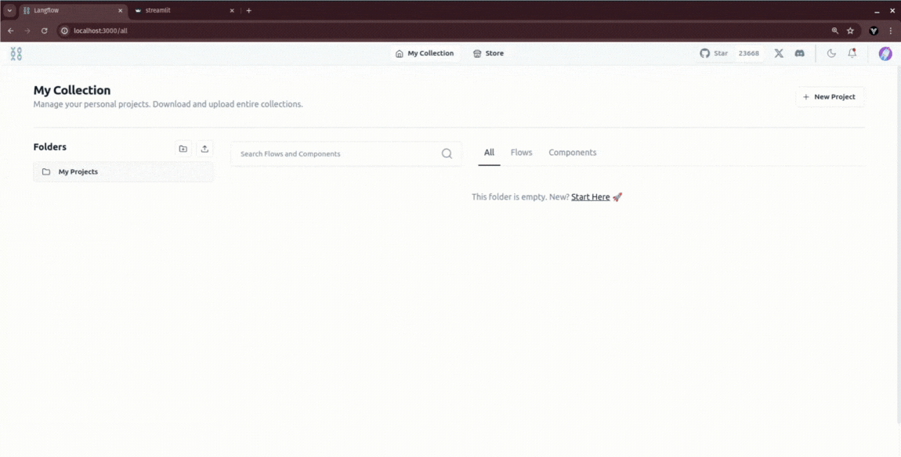
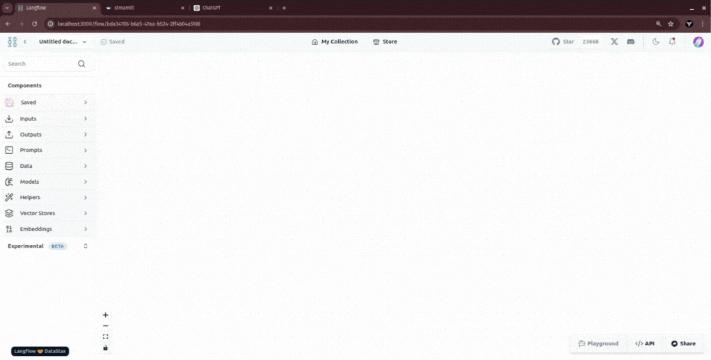

# langflow-streamlit

`langflow-streamlit` is an API that facilitates communication between [Langflow](https://github.com/logspace-ai/langflow) and [Streamlit](https://streamlit.io/) applications. This library enables seamless integration of Langflow's advanced language processing capabilities with Streamlit's user-friendly interface, allowing developers to create interactive applications that leverage powerful language models.

## Features

- **Easy integration:** Quickly set up communication between Langflow and Streamlit with minimal configuration.
- **Simple deployment:** Easily install and run the API with `pip` or `poetry`.
- **Flexible execution:** Run the full stack (Langflow + streamlit API) or just the Streamlit frontend with API backend.

## Requirements

- Python 3.10 or higher
## Installation

### Option 1: Install via pip

```bash
python3 -m venv env
source env/bin/activate
pip install langflow-streamlit==0.1.5
```

### Option 2: Clone the repository and use Poetry

1. Clone the repository:
   ```bash
   git clone https://github.com/yaitec/langflow-streamlit.git
   cd langflow-streamlit
   ```

2. Install Poetry if you haven't already:
   ```bash
   pip install poetry
   ```

3. Install the project dependencies:
   ```bash
   poetry install
   ```

### Running the Application

1. Run the full stack (Langflow, API, and Streamlit):
   ```bash
   python -m langflow-streamlit run
   ```

2. Run only the Streamlit frontend and API backend:
   ```bash
   python -m langflow-streamlit run --streamlit-only
   ```

---

## Usage

###  How to get Streamlit's Flows from the store

The gif below shows how to search, download, and run Streamlit's flow:

<p align="center">
  
</p>


### Using Streamlit Components in Langflow

The gif below shows how to use `Listen` and `Send` components:

<p align="center">
  
</p>


### Streamlit's Components

Langflow provides the following Streamlit components:

- **[Send](./send.md)**: Send messages to a Streamlit chat session.
- **[Listen](./listen.md)**: Listen for incoming messages in a Streamlit chat, altering the layout of the Streamlit application.

---

## Environment variables

| VARIABLE       | DESCRIPTION                                                  | DEFAULT |
| -------------- | ------------------------------------------------------------ | ------- |
| STREAMLIT_ONLY | If True runs only streamlit and streamlit API, else runs langflow too | False   |

#### pip

```
langflow-streamlit --streamlit-only
```

#### make with zshell or bash

```
export STREAMLIT_ONLY=True
```

#### make powershell

```
$env:STREAMLIT_ONLY = "True"
```

#### Notes

  - The Streamlit chat runs on port 5001 by default.
  - The Streamlit API runs on port 7881 by default.
  - Langflow runs on port 7860 by default.
  - You can set streamlit_only environment variable to runs with or without langflow.

### Using Poetry (after cloning the repository)

1. Run the full stack:
   ```bash
   poetry run langflow-streamlit run
   ```

2. Run only the Streamlit frontend and API backend:
   ```bash
   poetry run langflow-streamlit run --streamlit-only
   ```

### Using Make commands

1. Run the full stack:
   ```bash
   make start
   ```

2. Run only the Streamlit frontend and API backend:
   ```bash
   make start-streamlit-only
   ```

## Development

To set up the development environment:

1. Clone the repository (if you haven't already).
2. Install development dependencies:
   ```bash
   poetry install --with dev
   ```

3. Run tests:
   ```bash
   make test
   ```

4. Check code style:
   ```bash
   make lint
   ```

## Contributing

Contributions are welcome! Please feel free to submit a Pull Request or open an Issue on the GitHub repository.

1. Fork the repository
2. Create your feature branch (`git checkout -b feature/AmazingFeature`)
3. Commit your changes (`git commit -m 'Add some AmazingFeature'`)
4. Push to the branch (`git push origin feature/AmazingFeature`)
5. Open a Pull Request

## License

This project is licensed under the MIT License. See the [LICENSE](./LICENSE) file for details.

## Contact

YAITEC - contact@yaitec.org

Project Link: [https://github.com/yaitec/langflow-streamlit](https://github.com/yaitec/langflow-streamlit)
